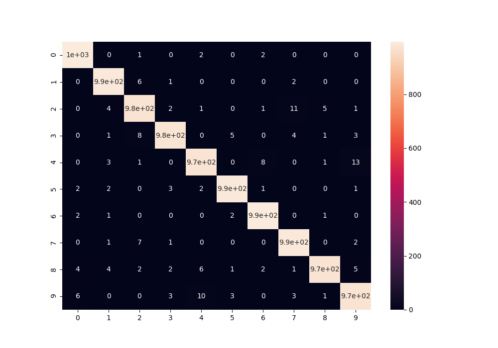

# TASK

The task is to predict mnist digits, while trying to minimize the false positive rates by using a decision mechanism that says 'not sure' for data points its not sure.

Confusion Matrix

The basic model is a cnn based upon [1]. It consists of 3 blocks of convolutions, each block having the same number of filters. Summarized as 

784 - [32C3-32C3-32C5S2] - DRPO - [64C3-64C3-64C5S2] - DRPO - 128F -  DRPO - 10F - sigmoid

32C3 := Filters = 32 , kernel size = 3, stride = 1
32C3 := Filters = 32 , kernel size = 3, stride = 1
32C3 := Filters = 32 , kernel size = 5, stride = 2

64C3 := Filters = 64 , kernel size = 3, stride = 1
64C3 := Filters = 64 , kernel size = 3, stride = 1
64C3 := Filters = 64 , kernel size = 5, stride = 2

128F := Fully Connected Layer with 128 as output
10F := Fully Connected Layer with 10 as output

DRPO := Dropout with probability to drop as .4
Each layer other than the final layer are relu
Each layer has batch-normalization 

This leads to the following scores.

Class | True Pos. | True Neg. | False Pos. | False Neg. |
------|---------|---------|--------|--------|
   0  | 99.5918 | 99.9778 | 0.0221 | 0.4081 |
   1  | 99.9118 | 99.9435 | 0.0564 | 0.0881 |
   2  | 99.6124 | 99.8773 | 0.1226 | 0.3875 |
   3  | 99.6039 | 99.9221 | 0.0778 | 0.3960 |
   4  | 99.7963 | 99.9556 | 0.0443 | 0.2036 |
   5  | 99.1031 | 99.9451 | 0.0548 | 0.8968 |
   6  | 99.2693 | 99.9668 | 0.0331 | 0.7306 |
   7  | 99.2217 | 99.9331 | 0.0668 | 0.7782 |
   8  | 99.5893 | 100.0   | 0.0    | 0.4106 |
   9  | 99.5105 | 99.9465 | 0.0534 | 0.4894 |
 Mean | 99.4053 | 99.9443 | 0.0556 | 0.5946 |

The second part of the task is to reduce the false negative rate, by not predicting some of the data points based on a criteria. I use bayesian CNN for this part as proposed in [2]. In this work Gal et al. proposed that dropouts can be interpretted as an ensemble of several models while testing whereas each configuration being one model while training. This leads to the fact that the prediction of the model at test time is an aggregation of a distribution over models, hence the variance in prediction (note with dropouts at test times too) can be treated as model variance.

I use this variance as a sign of the model not being sure on the input with a threshold of .04

After using the decision criteria, the results are the following

Class | True Pos. | True Neg. | False Pos. | False Neg. |
------|---------|---------|--------|--------|
  0   | 99.8962 | 99.9886 | 0.0113 | 0.1037 |
  1   | 100.0   | 99.9884 | 0.0115 | 0.0    |
  2   | 100.0   | 99.9886 | 0.0113 | 0.0    |
  3   | 99.8996 | 100.0   | 0.0    | 0.1003 |
  4   | 99.8962 | 99.9773 | 0.0226 | 0.1037 |
  5   | 99.8859 | 99.9887 | 0.0112 | 0.1140 |
  6   | 99.7874 | 99.9887 | 0.0112 | 0.2125 |
  7   | 99.9002 | 99.9886 | 0.0113 | 0.0997 |
  8   | 99.8955 | 100.0   | 0.0    | 0.1044 |
  9   | 99.7952 | 99.9773 | 0.0226 | 0.2047 |
Mean  | 99.8956 | 99.9886 | 0.0113 | 0.1043 |

Left Out Percentage : 1.99%

[1] https://www.kaggle.com/cdeotte/how-to-choose-cnn-architecture-mnist

[2] http://mlg.eng.cam.ac.uk/yarin/thesis/thesis.pdf

<!-- 
# DATA DESCRIPTION

The data file mnist.csv contains gray-scale images of hand-drawn digits,
from zero through nine.

Each image is 28 pixels in height and 28 pixels in width, for a total of 784
pixels in total. Each pixel has a single pixel-value associated with it,
indicating the lightness or darkness of that pixel, with higher numbers meaning
darker. This pixel-value is an integer between 0 and 255, inclusive.

The data set (mnist.csv), has 785 columns. The first column, called
"label", is the digit that was drawn by the user. The rest of the columns
contain the pixel-values of the associated image.

Each pixel column in the training set has a name like pixelx, where x is an
integer between 0 and 783, inclusive. To locate this pixel on the image,
suppose that we have decomposed x as x = i * 28 + j, where i and j are integers
between 0 and 27, inclusive. Then pixelx is located on row i and column j of a
28 x 28 matrix, (indexing by zero).

For example, pixel31 indicates the pixel that is in the fourth column from the
left, and the second row from the top, as in the ascii-diagram below.

Visually, if we omit the "pixel" prefix, the pixels make up the image like this:

000 001 002 003 ... 026 027
028 029 030 031 ... 054 055
056 057 058 059 ... 082 083
 |   |   |   |  ...  |   |
728 729 730 731 ... 754 755
756 757 758 759 ... 782 783 

# ACKNOWLEDGEMENTS
More details about the dataset, including algorithms that
have been tried on it and their levels of success, can be found at
http://yann.lecun.com/exdb/mnist/index.html. The dataset is made available
under a Creative Commons Attribution-Share Alike 3.0 license. -->
